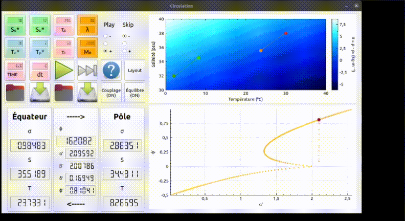
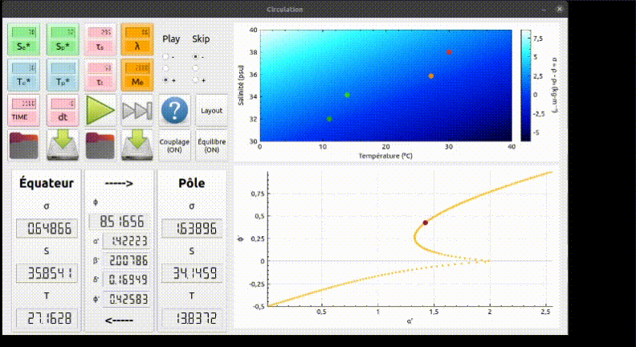

# Équilibres

## Discussion sur la stabilité des positions d'équilibre.

#### Au départ, la mise à l'équilibre est rapide :

 

#### Dans les deux directions, si les grandeurs de forçage varient assez lentement, la position suit la courbe de l'équilibre.

 
 

#### La même chose se produit lorsque des paramètres autres que les températures de forçage sont modifiés.

 
 
 
 

#### Le passage d'une position d'équilibre à l'autre met un peu de temps à s'enclencher mais s'effectue rapidement une fois suffisamment lancé.

 

#### De même lors du retour à la première position d'équilibre.

 

#### Si on perturbe le système trop brutalement, il peut passer par des positions très éloignées de l'équilibre avant de se rééquilibrer.

 
 

#### Voire dans des cas extrêmes:

 

#### La dernière partie de la courbe est constituée de positions d'équilibre instables. Tant qu'on ne l'atteint pas on peut redescendre sur la courbe du bas:

 

#### Et dès qu'on la dépasse le système retourne à l'autre position d'équilibre stable.

 
